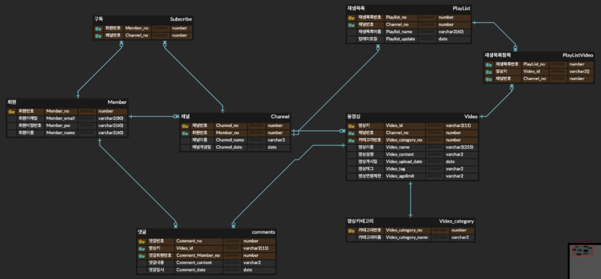

# video-platform



## API Document

### Model

#### Member
```javascript
Member : {
            "memberEmail": "string",
            "memberName": "string",
            "memberNo": 0,
            "memberPw": "string",
            "userRole": "ADMIN"
          }
```

#### Channel
```javascript
Channel : {
    "channelDate": {},
    "channelName": "string",
    "channelNo": 0,
    "member": {}
  }
```


#### Video
```javascript
Video : {
          "channel": {},
          "videoAgelimit": "string",
          "videoCategory": {
            "videoCategoryName": "string",
            "videoCategoryNo": 0
          },
          "videoContent": "string",
          "videoId": "string",
          "videoName": "string",
          "videoTag": "string",
          "videoUploadDate": {}
        }
```

#### Comments
```javascript
{
  "commentContent": "string",
  "commentDate": {},
  "commentEdit": "string",
  "commentNo": 0,
  "member": {},
  "video": { }
}
```

#### Playlist
```javascript
{
    "channel" :{},
    "playlistNo" : 0,
    "playlistName" : "string",
    "playlistUpdate" : {}
}
```

### Controller

| Category | Summary | Method | URI | Params | Request Body | Success Code | Response Body |
| :---: | :---: | :---: | :---: | --- | --- | --- | --- |
|비디오|비디오 업로드|Post| video/upload | MultipartFile(param_name = video) | channelNo = Long <br/> videoCategoryNo = int <br/> videoName = String <br/> videoContent = String <br/> videoUploadDate = TimeStamp <br/> videoTag = String <br/> videoAgelimit = String || [Video](#Video) |
|비디오|비디오 뷰|Get| video/view | videoId = String | | | [Video](#Video) |
|비디오|비디오 정보 수정|Put| video/edit | X | videoId = String <br/> videoName = String <br/> videoContent = String | | [Video](#Video) |
|비디오|비디오 삭제| Delete | video/delete | X | videoId = String | | [Video](#Video) |
|댓글|댓글 불러오기|Get| video/comments | videoId = String <br/>page = int| X | | List<[Comments](#Comments)> |
|댓글|댓글 등록|Post| video/comments | X | videoId = String <br/> memberNo = Long <br/> commentContent = String <br/> commentDate = Timestamp|| X |
|댓글|댓글 수정|Put| video/comments | X | commentNo = Long <br/> commentContent = String || [Comments](#Comments) |
|댓글|댓글 삭제|Delete| video/comments | X | commentNo = Long || X |
|채널|채널 정보 불러오기|Get| channel/channel | X | channelNo = Long || [Channel](#Channel) |
|채널|채널 생성|Post| channel/channel | X | memberNo = Long <br/> channelName = String <br/> channelDate = Timestamp || [Channel](#Channel) |
|채널|채널 정보 수정|Put| channel/channel | X | channelNo = Long <br/> channelName = String || [Channel](#Channel) |
|채널|채널 삭제|Delete| channel/channel | X | channelNo = Long || X |
|플레이리스트|플레이리스트 생성|Post| channel/createPlayList | X | channelNo = Long <br/> playlistName = String|| [Playlist](#Playlist) |
|플레이리스트|플레이리스트 수정|Post| channel/editPlayList | X | playlistNo = Long <br/> playlistName = String|| [Playlist](#Playlist) |
|플레이리스트|플레이리스트 조회|Get| channel/getPlayList | X | channelNo = Long || List<[Playlist](#Playlist)> |
|플레이리스트|플레이리스트 삭제|Delete| channel/deletePlayList | X | channelNo = Long <br/> playlistName = String|| X |
|플레이리스트|플레이리스트 동영상 조회|Get| channel/getPlayListVideo | X | playlistNo = Long || List<[Video](#Video)> |
|플레이리스트|플레이리스트 동영상 추가|Post| channel/addPlayListVideo | X | playlistNo = Long <br/> videoId = List<String>|| X |
|플레이리스트|플레이리스트 동영상 삭제|Delete| channel/deletePlayListVideo | X | playlistVideoNo = List<Long>|| X |
